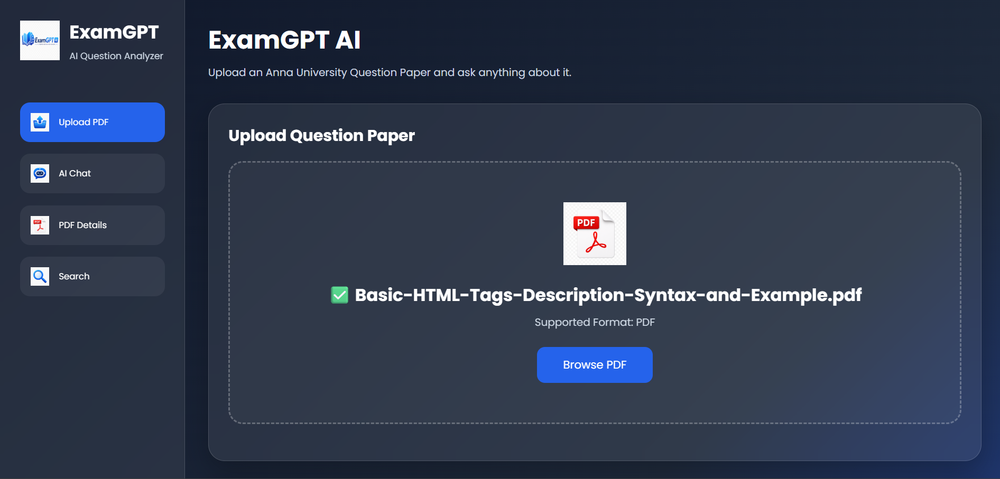
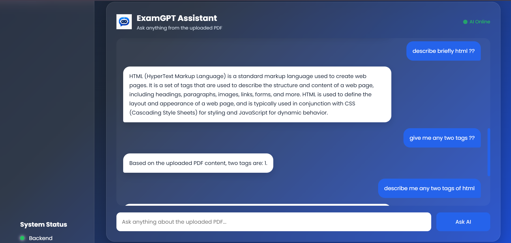
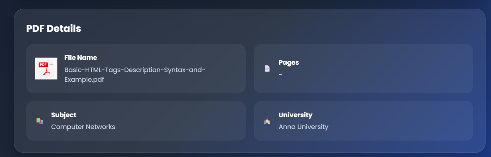

# 📚 ExamGPT – AI-Powered Exam Preparation Assistant

## Overview

ExamGPT is an AI-powered web application designed to help students prepare for exams more efficiently. It provides instant answers, explains difficult concepts, generates quizzes, summarizes study materials, and offers personalized learning support through an intelligent chatbot interface.

The project combines modern web technologies with artificial intelligence to create a simple, responsive, and user-friendly platform that makes learning more interactive and effective.


# Features

* 🤖 AI-powered chatbot for answering academic questions
* 📖 Instant concept explanations in simple language
* 📝 Quiz generation for practice and self-assessment
* 📚 Study notes and chapter summaries
* 🔍 Smart search for educational topics
* 💡 Personalized learning assistance
* 🌙 Light and Dark mode support
* 📱 Fully responsive design for desktop, tablet, and mobile
* ⚡ Fast and modern user interface
* 🔒 Secure authentication system (optional)


# Tech Stack

### Frontend

* HTML5
* CSS3
* JavaScript (ES6)
* Bootstrap / Tailwind CSS (depending on implementation)

### Backend

* Node.js
* Express.js

### Database

* MongoDB

### AI Integration

* OpenAI API (or compatible AI model)

### Version Control

* Git
* GitHub


# Project Structure

```
ExamGPT/
│
├── frontend/
│   ├── index.html
│   ├── css/
│   ├── js/
│   └── assets/
│
├── backend/
│   ├── server.js
│   ├── routes/
│   ├── controllers/
│   ├── models/
│   └── config/
│
├── public/
├── .env
├── package.json
├── README.md
└── LICENSE
```


# Installation

Clone the repository:

```bash
git clone https://github.com/yourusername/examgpt.git
```

Move into the project directory:

```bash
cd examgpt
```

Install dependencies:

```bash
npm install
```

Create a `.env` file and add your API keys:

```env
OPENAI_API_KEY=your_api_key
PORT=5000
MONGODB_URI=your_database_url
```

Start the development server:

```bash
npm start
```

Open your browser and visit:

```
http://localhost:5000
```


# How It Works

1. User opens the ExamGPT website.
2. The user enters an academic question or selects a study feature.
3. The request is sent to the backend server.
4. The backend communicates with the AI model.
5. The AI processes the request and generates an accurate response.
6. The response is displayed instantly in the chat interface.
7. Users can continue asking questions, generate quizzes, or request summaries.


# Key Modules

### AI Chat Assistant

Provides instant responses to educational questions with clear explanations.

### Quiz Generator

Creates practice questions based on selected topics.

### Study Notes

Generates concise notes and summaries for faster revision.

### Concept Explainer

Breaks down complex topics into easy-to-understand explanations.

### User Interface

Offers a clean, responsive, and intuitive design for seamless learning.


# Future Enhancements

* Voice-based AI assistant
* PDF upload and analysis
* AI-generated flashcards
* Personalized study plans
* Progress tracking dashboard
* Leaderboard and gamification
* Multi-language support
* Video lecture recommendations
* OCR support for handwritten notes
* Offline mode with cached content


# Advantages

* Saves study time
* Provides instant learning support
* Encourages self-paced learning
* Improves exam preparation
* Accessible anytime and anywhere
* User-friendly interface
* AI-powered personalized assistance
* Responsive across all devices


# Use Cases

* School students
* College students
* Competitive exam aspirants
* Teachers
* Online learners
* Self-study enthusiasts
* Educational institutions


# Screenshots

You can add screenshots of:

* Home Page

* AI Chat Interface

* PDF Details

* Mobile Responsive View



# Contributing

Contributions are welcome.

1. Fork the repository.
2. Create a new feature branch.
3. Commit your changes.
4. Push the branch.
5. Open a Pull Request.


# License

This project is licensed under the MIT License.


# Author

PRITHIYANGA A 

DEPARTMENT OF ARTIFICIAL INTELLIGENCE 

AI Developer | Full Stack Developer | Web Development Enthusiast


